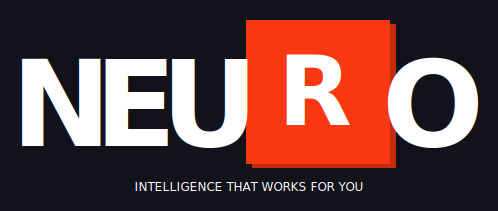

# Wiki Codex v2

> Intelligent knowledge base for developers.
> Documentation, notes, terms & instructions with AI analysis.



---

## Features

| Module | Description |
|---|---|
| **Documents** | Upload `.md` `.txt` `.html`, Markdown preview, categories, tags, favorites |
| **Search** | Text search + AI-powered semantic search |
| **Notes** | CRUD with AI analysis (topics, title, mood) |
| **Dictionary** | AI term extraction from documents, duplicate merging |
| **Instructions** | Built-in templates + AI extraction from docs |
| **AI** | Auto-categorization, tag/category suggestions, semantic search |
| **Branding** | NEURO logo with automatic theme detection (light/dark/mono/outline/inverted) |
| **Backups** | DB snapshots (last 10 retained) |
| **Keyboard** | `Ctrl+K` search, `Ctrl+N` new note, `Ctrl+U` upload, `Esc` back |

---

## Tech Stack

```
Built with: Next.js 16 + TypeScript 5 + Tailwind CSS 4 + PostgreSQL + Prisma ORM + Zustand
```

| Technology | Purpose |
|---|---|
| Next.js 16 | Framework (App Router, Turbopack) |
| TypeScript 5 | Language |
| Tailwind CSS 4 | Styling |
| shadcn/ui | Component Library |
| PostgreSQL | Database |
| Prisma ORM | ORM |
| Zod | API Validation |
| Zustand | State Management |
| z-ai-web-dev-sdk | AI Integration |
| NEURO Branding | Logo system (agent-logo) |

---

## Quick Start

```bash
# 1. Setup environment
cp .env.example .env

# 2. Install dependencies
bun install

# 3. Create database
bun run db:push

# 4. Run dev server
bun run dev
```

---

## Configuration

All environment variables are documented in `.env.example` per REPRODUCIBILITY-STANDARD.

| Variable | Required | Default | Description |
|---|---|---|---|
| `DATABASE_URL` | Yes | - | PostgreSQL connection string |
| `OPENAI_API_KEY` | No | - | For AI features (analysis, semantic search) |

---

## Project Structure

```
src/
  app/
    layout.tsx                          # Root layout (ThemeProvider, Toaster, NEURO metadata)
    page.tsx                            # SPA shell (sidebar + header + views)
    globals.css                         # Tailwind + custom styles
    api/
      route.ts                          # GET  /api             health check
      seed/route.ts                     # POST /api/seed         dev-only DB seeding
      backup/route.ts                   # GET|POST /api/backup   backup management
      logo-theme/route.ts              # GET  /api/logo-theme   NEURO logo theme detection
      signature/route.ts               # GET  /api/signature    NEURO email signature
      documents/
        route.ts                        # GET|POST  /api/documents       (zod)
        [id]/route.ts                   # GET|PATCH|DELETE /api/documents/:id
        related/route.ts                # POST /api/documents/related     AI similar docs
      ai/analyze/route.ts               # POST /api/ai/analyze            AI doc analysis
      categories/
        route.ts                        # GET|POST|DELETE /api/categories (zod)
        suggest/route.ts                # POST /api/categories/suggest    AI suggestions
      tags/route.ts                     # GET|POST|DELETE /api/tags       (zod)
      terms/
        route.ts                        # GET|POST|PATCH|DELETE /api/terms
        parse/route.ts                  # POST /api/terms/parse           AI extraction
      notes/
        route.ts                        # GET|POST /api/notes             (zod)
        [id]/route.ts                   # GET|PATCH|DELETE /api/notes/:id
        analyze/route.ts                # POST /api/notes/analyze         AI analysis
      instructions/
        route.ts                        # GET|POST /api/instructions
        [id]/route.ts                   # DELETE /api/instructions/:id
      search/semantic/route.ts          # POST /api/search/semantic       AI search
  components/
    codex/                              # App components
      neuro-logo.tsx                    # NEURO brand logo (SVG, theme-aware)
      sidebar.tsx                       # Navigation with NEURO branding
      header.tsx                        # Search bar, theme toggle, actions
      dashboard-view.tsx                # Stats grid, tech logos, recent docs
      documents-view.tsx                # Document list (grid/list, filters)
      document-viewer.tsx               # Markdown viewer, AI analysis, breadcrumbs
      upload-view.tsx                   # Drag & drop (.md/.txt/.html)
      notes-view.tsx                    # Notes list
      note-editor.tsx                   # Note editor with AI
      dictionary-view.tsx               # Terms dictionary (merge, dedup)
      instructions-view.tsx             # Instructions (templates + extracted)
      tech-logos.tsx                    # Brand SVG logos (PostgreSQL, NEURO)
    ui/                                 # shadcn/ui (39 components)
  hooks/
    use-toast.ts                        # Toast notifications
    use-mobile.ts                       # Mobile detection
    use-codex-data.ts                   # Data hooks (documents, notes, counters, terms)
    use-keyboard-shortcuts.ts           # Global hotkeys (Ctrl+K/N/U, Esc)
  lib/
    store.ts                            # Zustand store (views, filters, UI state)
    types.ts                            # TypeScript interfaces
    db.ts                               # PrismaClient singleton (PostgreSQL)
    db-filter.ts                        # PostgreSQL filter builder
    backup.ts                           # Backup management
    format.ts                           # pluralize, formatDate, formatFileSize
    validations.ts                      # Zod schemas for API validation
    api-retry.ts                        # Retry with exponential backoff (agent-toolkit)
    circuit-breaker.ts                  # Circuit breaker pattern (agent-toolkit)
    health-check.ts                     # Health monitoring (agent-toolkit)
    fallback-manager.ts                 # Multi-provider fallback (agent-toolkit)
    sanitize.ts                         # Input sanitization
    utils.ts                            # cn() -- Tailwind merge
prisma/
  schema.prisma                         # Database schema (6 models, PostgreSQL)
  migrations/
    0_init/migration.sql                # Initial migration
skills/                                 # Agent skills (agent-toolkit)
  git-safe-ops/SKILL.md
  dev-watchdog/SKILL.md
  api-retry/SKILL.md
  health-check/SKILL.md
  fallback/SKILL.md
instructions/                           # Agent behavioral instructions (agent-toolkit)
  onboarding-protocol.md
  git-workflow-rules.md
  language-rule.md
  diagnostic-disclosure.md
  writing-plans.md
  sandbox-rules.md
standards/                              # Governance documents (agent-toolkit)
  No-Unicode_Policy_v2.1.md
  MARKDOWN_STANDARD_EN_v2.1.md
  MARKDOWN_STANDARD_RU_v2.1.md
  REPRODUCIBILITY-STANDARD.md
  README_TEMPLATE.md
  TASK_TEMPLATE.md
  README_WORKLOG.md
  WORKLOG.md
templates/                              # Operational templates (agent-toolkit)
  WORKLOG.md
  TASK_TEMPLATE.md
  README_WORKLOG.md
  workflows/
  e2e/
logos/                                  # NEURO brand assets (agent-logo)
  light.svg, dark.svg, mono.svg, outline.svg, inverted.svg
  mono-dark.svg, outline-dark.svg
  light.png, light.jpg
scripts-logo/                           # Logo detection scripts (agent-logo)
  logo-agent.js
  setup.sh
  prepare-commit-msg
eslint-rules/
  no-unicode-policy.mjs                 # ESLint rule: No-Unicode Policy v1.0
AGENT_RULES.md                          # AI agent behavioral rules (agent-toolkit)
PROJECT_CONFIG.md                       # Project-specific settings (agent-toolkit)
Dockerfile                              # Multi-stage build (prisma migrate deploy)
.github/workflows/
  validate.yml                          # Structure + emoji + signature checks
  logo.yml                              # Logo theme detection CI
```

---

## Data Models

```
Category --------< Document >-------- Tag
  id                 id                  id
  name               title               name
  description        content             color
  color              summary
  sortOrder          fileType             DocumentTag
                     fileSize              documentId
  Term               fileName             tagId
  id                 categoryId
  term (unique)      isStarred
  translation        viewCount
  explanation
  usage              Note
  documentId          id
                      title
  Instruction         content
  id
  title              steps (JSON)
  description        sourceDocId
  isBuiltIn
```

---

## API Reference

> All POST/PATCH endpoints validated via Zod schemas (`src/lib/validations.ts`).
> Invalid requests return `400` with error details.

### Documents

```
GET    /api/documents?search=&categoryId=&tagId=&starred=&page=&limit=
POST   /api/documents                          # Dedup by title (409 on conflict)
GET    /api/documents/:id                      # +viewCount increment
PATCH  /api/documents/:id                      # title, categoryId, isStarred, content, tagIds
DELETE /api/documents/:id
POST   /api/documents/related                  # AI: find similar documents
```

### AI

```
POST /api/ai/analyze              # Document analysis: summary, category, tags
POST /api/search/semantic         # Semantic search across documents
POST /api/categories/suggest      # AI: suggest new categories
POST /api/terms/parse             # AI: extract terms from text
POST /api/notes/analyze           # Note analysis: title, summary, topics, mood
POST /api/instructions?extractFromDocId=   # AI: extract instructions
```

### Categories & Tags

```
GET    /api/categories            # List with _count.documents
POST   /api/categories            # Create (dedup)
DELETE /api/categories?id=
GET    /api/tags                  # List with _count.documents
POST   /api/tags                  # Create (dedup)
DELETE /api/tags?id=
```

### Terms

```
GET    /api/terms?search=&documentId=&duplicates=true
POST   /api/terms                  # Create (dedup)
DELETE /api/terms?id= | ?ids=a,b,c # Single + bulk delete
PATCH  /api/terms                  # Merge duplicates (keepId + mergeIds)
```

### Notes

```
GET    /api/notes?search=
POST   /api/notes
GET    /api/notes/:id
PATCH  /api/notes/:id
DELETE /api/notes/:id
```

### Instructions

```
GET    /api/instructions                    # List (extracted + built-in)
POST   /api/instructions?extractFromDocId=  # Extract from document
DELETE /api/instructions/:id
```

### NEURO Branding

```
GET /api/logo-theme?project=&mode=auto|dark|light   # Logo theme detection
GET /api/signature?project=&name=&role=&email=&phone=&mode=auto|dark|light  # Email signature
```

### System

```
GET  /api           # Health check
POST /api/seed      # Dev-only DB seeding (blocked in production)
GET  /api/backup    # List backups
POST /api/backup    # Create backup
```

---

## Standards & Rules

All standards are mandatory for development, AI generation, and application usage.

---

### Standard 1: No-Unicode Policy v2.1

> Icon and graphic usage standard. Design System / Engineering Governance level.

#### 1.1 Purpose

This standard establishes a **strict ban** on all Unicode graphic symbols (including emoji) across all product layers: UI, content, code, system communications.

Goals:

- Ensure visual consistency
- Maintain professional product level
- Guarantee control via design system
- Eliminate uncontrolled visual artifacts

#### 1.2 Absolute Ban on Unicode Graphics

**What is banned:**

| Category | Examples |
|---|---|
| Emoji | Any pictograms: emotions, objects, UI symbols, all emoji packs on all platforms |
| Symbol pseudo-graphics | Arrows, markers, decorative elements, highlighting symbols |
| Unicode icons | Any symbols used as icon replacements: statuses, actions, notifications |

**Scope of the ban:**

| Layer | What is banned |
|---|---|
| UI | Buttons, menus, tables, tooltips, notifications, statuses |
| Content | In-product texts, onboarding, system messages, in-UI documentation |
| Code | Comments, strings, mock data, variable names |
| System communications | Logging, errors, API responses, system events |

#### 1.3 Only Acceptable Standard -- SVG

**Basic rule:** any visual symbol = **SVG ONLY**

**Icon library (fixed at architecture level):** Lucide (primary, used in project).

**Brand logos:** Use official vendor SVG logos when displaying technologies in UI.

#### 1.4 Stack Signature Format (Mandatory)

- Placement: footer, fixed position
- Format: `Built with: Next.js 16 + TypeScript 5 + Tailwind CSS 4 + PostgreSQL + Prisma ORM + Zustand`
- Allowed: Latin, Cyrillic, digits
- Banned: Any symbols outside standard alphabet, any graphic elements

---

### Standard 2: Z.ai Reproducibility Standard v1.0

> **`git clone` + `bun install` + `bun run dev` = working application.**
> Always. Everywhere. On any machine. No exceptions.

---

### Rule 3. Deduplication-First

All create endpoints **must** check for existing records before creation.

---

### Rule 4. Safe Delete Policy

Deleting any entity requires **explicit confirmation** via AlertDialog. All 7 entities. No exceptions.

---

### Rule 5. AI Prompt Language Standard

All AI system prompts are written **in Russian** (except instruction extraction prompt -- in English per No-Unicode Policy).

---

## Agent Rules

> Integrated from `agent-toolkit` v1.5.0

This project includes AI agent behavioral rules:

- **AGENT_RULES.md** -- Core behavioral rules for AI agents
- **PROJECT_CONFIG.md** -- Project-specific settings
- **instructions/** -- 6 detailed behavioral instruction files
- **skills/** -- 5 automated agent capabilities (git-safe-ops, dev-watchdog, api-retry, health-check, fallback)
- **standards/** -- 8 governance documents

---

## NEURO Branding

> Integrated from `agent-logo` v1.0.0

This project uses the NEURO brand system:

- **Logo variants:** 7 SVG themes (light, dark, mono, mono-dark, outline, outline-dark, inverted)
- **Auto-detection:** Logo-agent detects appropriate theme from project description
- **API endpoints:** `/api/logo-theme` and `/api/signature`
- **Brand colors:** Coral `#FA3913`, Dark `#12121a`, Graphite `#343439`
- **Icon standard:** SVG only (Lucide library)

---

## Scripts

| Command | Description |
|---|---|
| `bun run dev` | Start dev server (port 3000) |
| `bun run build` | Production build |
| `bun run lint` | ESLint check |
| `bun run db:push` | Push Prisma schema to database |
| `bun run db:migrate` | Create and apply migration |
| `bun run logo` | Detect NEURO logo theme |
| `bun run vercel-build` | Vercel deployment build |

---

Built with: Next.js 16 + TypeScript 5 + Tailwind CSS 4 + PostgreSQL + Prisma ORM + Zustand
